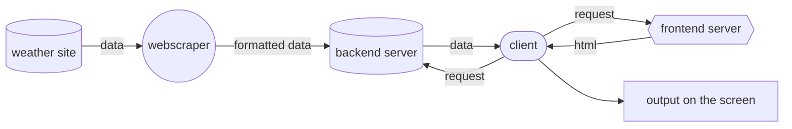

```mermaid
  flowchart LR
    A[("weather site")] -- data --> B(("webscraper"))

    B -- "formatted data" --> C[("backend server")]

    C -- data --> E

    D{{"frontend server </>"}} -- html --> E(["client"])

    E -- request --> C
      E -- request --> D
      E --> F

    F["output on the screen"]

```