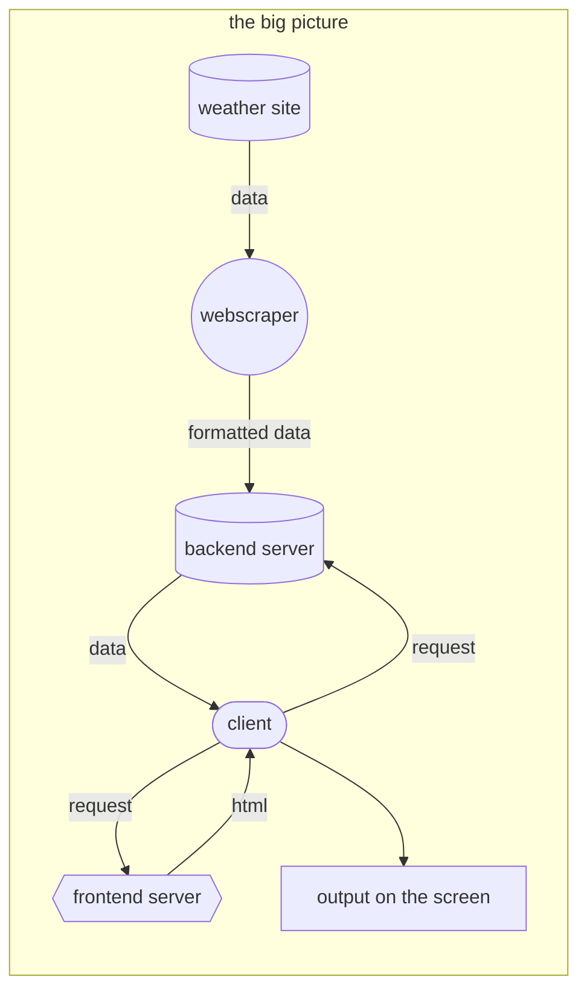

```mermaid
  flowchart LR
      subgraph the big picture
        A[("weather site")] -- data --> B(("webscraper"))
    
        B -- "formatted data" --> C[("backend server")]
    
        C -- data --> E
    
        D{{"frontend server </>"}} -- html --> E(["client"])
    
        E -- request --> C
          E -- request --> D
          E --> F
    
        F["output on the screen"]
        end
```